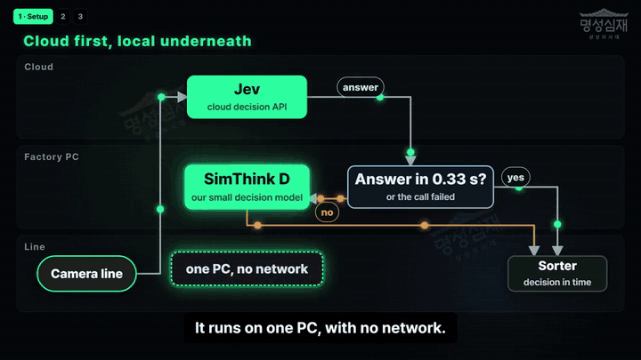

<p align="center"><a href="README.md">English</a> | <a href="README.ko.md">한국어</a> | <b>日本語</b></p>

<!-- source-sha256: defa99cb8ecbe2e437e2158c53b35d9366776e67f66d146cffe2cf1524f3ce22 -->

<p align="center"></p>

<p align="center">
  <a href="https://pypi.org/project/simthinkd/"></a>
  <a href="LICENSE"></a>
  
  <a href="https://github.com/MSSJ-AI-ORG/simthinkd/actions/workflows/test.yml"></a>
  <a href="https://colab.research.google.com/github/MSSJ-AI-ORG/simthinkd/blob/main/notebooks/quickstart.ipynb"></a>
  <a href="https://arxiv.org/abs/2610.04810"></a>
</p>

<p align="center"><b>ネットワークが落ちても、判断は手元で。</b></p>

<!-- source: README.md (English is the reference). Keep numbers and links identical; update this file when README.md changes. -->

SimThink D は、ネットワークが使えないときに代わりに判断する小さな CPU モデルです。
パラメータ数は 265,665 で、CPU コア 1 つで 1 回の判断に約 2 ms かかります。

工場シミュレーションでインターネットを 15 秒間切断しました。
ローカルのバックアップは部品 63 個のうち 59 個を正しく判定し、判断の遅れは一度もありませんでした。

<p align="center"><a href="assets/factory_fallback.mp4"></a></p>

<p align="center"><a href="https://mssj-ai-org.github.io/simthinkd/">紹介ページ</a> · <a href="https://mssj-ai-org.github.io/simthinkd/#demo">ブラウザで試す</a> · <a href="assets/factory_fallback.mp4">動画を見る（72 秒）</a> · <a href="examples/factory_twin/">工場のコード</a> · <a href="docs/PAPER.md">論文</a></p>

```bash
pip install simthinkd
```

ネットワークが落ちたとき、次の判断を担うのは何でしょうか。

## この文書で使う言葉

- **ティック (tick)**: ゲームや制御ループの 1 ステップ。Doom は毎秒 35 ティックで動くので、1 ティックは 28.6 ms です。
- **判断器 (decider)**: 小さなモデル。状況を表す短い文を受け取り、行動を 1 つ返します。
- **教師 (teacher)**: 自分で決めたルールを通常の関数として実装したもの。判断器は教師をまねて学びます。
- **知覚 (perception)**: ゲームの生の状態を短い文に変換するコード。

## インストール

```bash
pip install simthinkd
```

判断するだけならこれで足ります。必要なのは NumPy だけです。自分の判断器を学習させるには `train` の追加依存関係をインストールします（PyTorch が入ります。CPU 版で構いません）。

```bash
pip install "simthinkd[train]"
```

## まず動かす

```python
from simthinkd import Decider

d = Decider("doom-defend")
print(d.decide("seen: Demon left a30 d5 | enemies 1 | sway left | gun ready | ammo25"))
# TURN_LEFT (100%, 1.1 ms)
```

1 回の呼び出しが 1 回の判断です。短い文を渡すと、行動が 1 つ、その確率と判断にかかった時間とともに返ってきます。最初の呼び出しはモデルの読み込みがあるので遅くなります。その後は 1 回あたり約 1 ms です。

パッケージには判断器が 2 つ入っています。`doom-defend`（中央に立って戦う）と `doom-corridor`（廊下を戦いながら進む）です。

## 一度に多くの判断

1 回の呼び出しに、同じ状況についての質問を複数載せられます。1 つのバッチに複数の状況を載せることもできます。1 つずつ聞いたときと同じ答えが返ります。

```python
from simthinkd import Decider

d = Decider("doom-defend")
states = ["seen: Demon left a30 d5 | enemies 1 | sway left | gun ready | ammo25",
          "seen: Demon right a30 d5 | enemies 1 | sway right | gun ready | ammo25"]
answers = d.predict_batch([d.request(s) for s in states])   # many situations in one pass
print([a["operation"]["choice"] for a in answers])
# ['TURN_LEFT', 'TURN_RIGHT']
```

`simthinkd bench --batch` で、手元のマシンで時間がどこに使われているかを確認できます。詳細と制限: [docs/PARALLEL.md](docs/PARALLEL.md)。

## 数秒で自分の判断器を学習する

新しいタスクに必要なのは、知覚のステップと教師の 2 つです。下の `toy` モジュールは、工場の搬送ベルトにある検査ステーションを題材にした、架空の小さなタスクです。例と行動を自分のものに入れ替えて使ってください。

```python
import simthinkd
from simthinkd import toy

d = simthinkd.fit(toy.examples(3000), toy.ACTIONS, goal=toy.GOAL, out="inspection")
print(d.decide("part: defect dent | severity severe | image clear | belt normal | rework queue long"))
# REJECT (100%, 1.2 ms)
```

比較に利用できたのは CPU 環境のみでした。約 8 秒で学習が終わりました。新しい判断器は、見たことのない状態 500 個のうち 500 個で教師と同じ答えを出しました。

## 選ぶ代わりにスコアを出す

行動ではなく数値が欲しいこともあります。リスクの大きさ、優先度、予想待ち時間などです。`fit_score` は同じ小さなネットワークを、数値を 1 つ返すように学習させます。（状況の文, 数値）の組を渡してください。

```python
import random
import simthinkd
from simthinkd import toy

SEVERITY = {"minor": 20, "moderate": 45, "severe": 75}

def risk(s):  # your own rule or records give the number
    value = 0 if s["defect"] == "none" else SEVERITY[s["severity"]]
    value += 10 if s["image"] == "blurry" else 0
    value += 8 if s["belt"] == "fast" else 0
    value += 5 if s["defect"] != "none" and s["queue"] == "long" else 0
    return float(min(100, value))

rng = random.Random(7)
examples = [(text, risk(state)) for state, text in (toy.observe(rng) for _ in range(3000))]
s = simthinkd.fit_score(examples, goal="Rate how risky this part is, 0 to 100.", out="risk", low=0, high=100, quiet=True)
print(s.score("part: defect dent | severity severe | image clear | belt fast | rework queue long"))
# 87.99 (0.22 ms)
```

スクリプト全体は [examples/risk_score.py](examples/risk_score.py) にあります。この方法で学習したリスクスコアは、見たことのない部品 400 個に対して 0 から 100 の尺度で、平均誤差は 0.13 ポイントでした。どの 2 部品を比較しても、順序を正しく判定しました。

## 向いている場面

次の 3 つがすべて当てはまるとき、SimThink D が適しています。

1. **状況が短い 1 行に収まる。** 「seen: Demon left a30 d5 | enemies 1」のように項目がいくつかあるだけ。長い文章ではありません。
2. **出力が単純である。** 最大 8 個の行動から 1 つ、または数値 1 つ。
3. **高速、低コスト、またはオフラインで判断する必要がある。** ゲームのティックごと、ラインの部品ごと、制御ステップごと、あるいはネットワークが落ちたとき。

| 用途 | 合う理由 | ここで試す |
|---|---|---|
| ゲームのキャラクター | ティックごとに判断 1 回、毎秒 35 ティック | Doom の判断器 2 つ、`simthinkd bench` |
| 工場 PC のバックアップ判断器 | クラウドサービスが遅いときや落ちたときに代わりに判断 | [examples/factory_twin](examples/factory_twin/) |
| リスク・優先度のスコア | 項目ごとに数値 1 つを 1 ミリ秒を大きく下回る時間で | [examples/risk_score.py](examples/risk_score.py) |
| すでにあるルール | 例からルールを学び、約 2 ms で実行 | [自分の判断器を学習する](#数秒で自分の判断器を学習する) |

### 大規模モデルと組み合わせる

多くの場合、SimThink D は単独で使うより、大規模なシステムの一部として組み込むほうが効果的です。やり方は 2 つあります。

| やり方 | 仕組み | ここで試す |
|---|---|---|
| **一次フィルター** | SimThink D がすべてのケースに先に答えます。信頼度が設定したしきい値を下回るとき、そのケースだけを大規模モデルや人に回します。簡単なケースは低コストかつ高速に処理され、難しいケースは引き続き大規模モデルが扱います。 | `python examples/factory_twin/run.py --arm CASCADE --tau 0.9` |
| **ローカルのバックアップ** | 大規模モデルやクラウドサービスが先に答えます。答えが遅れたりネットワークが落ちたりしたら、手元のマシンの SimThink D が代わりに答えます。 | 上の工場の動画、[examples/factory_twin](examples/factory_twin/) |

ゲームのキャラクター (NPC) は、一次フィルターにぴったりのケースです。その場その場の動きは SimThink D がティックごとに処理し、計画や会話のように、発生頻度が低く処理に時間のかかる判断だけを大規模モデルに尋ねます。

次のような用途には向きません。

- **長い文章の評価**: エッセイやレポートなど。エッセイの段落で試した私たちのテストでは、単純な単語数のモデルのほうが良い結果でした。
- **入力した 1 行だけでは決まらない答え**: 答えがその行にない履歴に左右されるなら、その履歴を行に加えるか、別の手法を使用してください。
- **自由形式の出力**: リストから選ぶか数値を 1 つ返すだけで、文章は生成しません。

## 自分のモデルを測る

あなたのモデルは 1 ティック以内に答えますか。`simthinkd bench` はパッケージに同梱された記録済みの Doom の状態 1,050 個を順に入力し、リクエストを 1 つずつ送って判断ごとの時間を測ります。

```bash
simthinkd bench
simthinkd bench --url http://127.0.0.1:8000/v1/systemone --name my-model --tick-hz 35
```

2 行目は、[判断リクエスト](docs/PROTOCOL.md)を受け付けるサーバーなら何でも測れます。

## 同じ CPU、同じ状態

<p align="center">
  
</p>

<p align="center"><sub>同じゲーム、同じシード、同じ 6 コア CPU。左: SimThink D、1 回の判断に 1.9 ms、420 ティック中 1 ティックに間に合わない。右: Laya、421M パラメータのオープンな汎用判断モデルを、このゲームで学習させずに公開されたまま使用。1 回の判断に約 360 ms かかり、420 ティック中 390 ティックに間に合いません。暗いフレームは、判断器が答える前にゲームが先へ進んだことを示します。</sub></p>

**最初に読んでください。** Laya は汎用モデルで、このゲームでは学習していません。公開されている速度、質問 1 つあたり約 33 ms は GPU での値です。比較に利用できたのは CPU 環境のみでした。そのため、この表はリアルタイムのループの中での時間を比べています。全体の品質を比べるものではありません。

1 台のワークステーションの CPU（6 スレッド）と Doom の状態 1,050 個を使い、続いて同じシードで実際のゲームを 10 回行いました。「ティックに間に合わない」とは、判断器が答える前に過ぎてしまったティックのことです。

| 判断器 | パラメータ数 | 判断時間の中央値 | 1 ティック（28.6 ms）以内に終わった判断 | 実プレイで逃したティック |
|---|---|---|---|---|
| SimThink D | 265,665 | 1.8 ms | 100% | 0.1% |
| Laya（公開されたまま） | 約 421M | 365 ms | 0% | 84.2% |

### 既存の環境から使う

SimThink D は教師が知っていることしか知りません。推論はせず、長い文章は読まず、学習なしに新しい行動は扱えません。この比較を自分で試すには [benchmarks/](benchmarks/) を見てください。

| どこで | どうやって |
|---|---|
| どの言語、どのエンジンでも | `simthinkd serve doom-defend --port 11890` を起動し、[判断リクエスト](docs/PROTOCOL.md)を `/v1/systemone` に POST |
| Unity / C# | [docs/INTEGRATION_UNITY.md](docs/INTEGRATION_UNITY.md): 待っている間もゲームを止めないクライアントループ |
| ブラウザ | [web/](web/): サーバーを使わず、プレーンな JavaScript で同じモデルを実行 |
| Java / JVM のゲーム・エンジン | [java/](java/): 同じモデルを素の Java 8 でプロセス内で実行。重みは `tools/export_java_weights.py` で書き出し、Python とまったく同じ選択をすることをテストで確認 |
| 工場のライン（シミュレーター） | [examples/factory_twin/](examples/factory_twin/): 部品ごとに 400 ms の制限時間がある検査コンベヤー |
| Gradio | [space/](space/): 手元や Hugging Face Spaces で動かせる小さな Web デモ |
| MCP（Claude Desktop、Cursor など） | `pip install "simthinkd[mcp]"` のあと `python -m simthinkd.integrations.mcp_server` |
| LangChain / LangGraph | `from simthinkd.integrations.langchain_tool import simthinkd_tool` |

## 仕組み

- **入力**: 状況の文、目標、各行動の説明をハッシュ特徴に変えます。単語、単語ペア、3 文字の断片です。事前学習済みの言語モデルは入っていません。
- **モデル**: 小さな 2 層のネットワークが、候補となる各行動にスコアを付けます。すべての行動を一度に見て、較正された確率を出します。
- **学習**: ランダムな重みから始め、教師の選択から学びます。最良のチェックポイントは、ホールドアウトデータで選びます。
- **なぜ大事か**: 35 Hz のゲームでは、判断に 28.6 ms より長くかかるとティックに間に合いません。私たちの論文は、判断時間のコストと判断の質を分けて扱っています（[docs/PAPER.md](docs/PAPER.md)）。

## 制限

- 1 回の判断で行動は最大 8 個。
- 入力はテキストのみ。数値は「d5」「ammo25」のように短いトークンやビン（区間）に変換してください。
- 判断器は教師をまねます。性能は教師のルールの品質に左右されます。
- 確率は、その判断器固有のタスクに対してのみ較正されています。
- スコアモデルが返すのは数値 1 つです。誤差範囲は返しません。

## さらに

- [論文の図](docs/FIGURES.md)
- [再現できるもの](docs/REPRODUCE.md)
- [判断リクエストの形式](docs/PROTOCOL.md)
- [LinkedIn の工場動画](https://www.linkedin.com/feed/update/urn:li:activity:7510142949981057024/)

## 引用

SimThink D を使用する場合は、[CITATION.cff](CITATION.cff) で引用してください。GitHub に「Cite this repository」ボタンが表示されます。

- 論文: Shin, Lee, Jeong and Kwon, "Separating Decision Time from Decision Quality in the Real-Time Gap of Distilled Deciders: Evidence from a Game and a Conveyor Simulator", [arXiv:2610.04810](https://arxiv.org/abs/2610.04810)

同梱の判断器 2 つは、論文で評価したものとまったく同じ判断器です（SHA-256 が一致）。このリポジトリで再実行できるものと、まだ公開していないものは [docs/REPRODUCE.md](docs/REPRODUCE.md) にまとめています。

## 貢献

バグ報告や小規模なプルリクエストを歓迎します。[CONTRIBUTING.md](CONTRIBUTING.md) を見てください。

## クレジット

比較には Convai Innovations の [Laya](https://github.com/NandhaKishorM/laya)（Apache 2.0）を、Laya 自体には変更を加えず、小さなアダプター経由で実行しました。Doom の場面は [ViZDoom](https://github.com/Farama-Foundation/ViZDoom) によるものです。[NOTICE](NOTICE) を見てください。

## ライセンス

Apache 2.0。[LICENSE](LICENSE) を見てください。
