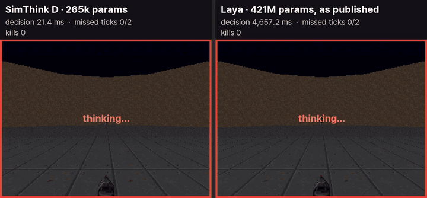

<p align="center"><b>SimThink D</b></p>

<p align="center">
  <a href="https://pypi.org/project/simthinkd/"></a>
  <a href="LICENSE"></a>
  
  <a href="https://github.com/MSSJ-AI-ORG/simthinkd/actions/workflows/test.yml"></a>
  <a href="https://colab.research.google.com/github/MSSJ-AI-ORG/simthinkd/blob/main/notebooks/quickstart.ipynb"></a>
  <a href="https://doi.org/10.5281/zenodo.23111615"></a>
</p>

**A tiny decision model that runs on one CPU core.** It has 265,665 parameters. It picks one action in about 2 ms. That is fast enough to decide inside every tick of a game or a control loop. No GPU is needed, not even for training.

<p align="center">
  
</p>

<p align="center"><sub>Same game, same seed, same 6-core CPU. Left: SimThink D, 1.9 ms per decision, 1 of 420 ticks missed. Right: Laya, a 421M-parameter open decision model, used as published without training on this game. It takes about 360 ms per decision and misses 390 of 420 ticks. A dark frame means the game moved on before the decider answered.</sub></p>

<div align="center">

[Open in Colab](https://colab.research.google.com/github/MSSJ-AI-ORG/simthinkd/blob/main/notebooks/quickstart.ipynb) · [Try it in your browser](web/index.html) · [Gradio demo](space/) · [Paper](docs/PAPER.md) · [Protocol](docs/PROTOCOL.md)

</div>

Video: [a simulated factory line keeps running when the internet drops, with SimThink D deciding on the factory PC](https://www.linkedin.com/feed/update/urn:li:activity:7510142949981057024/) (LinkedIn).

## Words used here

- **Tick**: one step of a game or control loop. Doom runs at 35 ticks per second, so one tick is 28.6 ms.
- **Decider**: the small model. It gets a short sentence about the situation and returns one action.
- **Teacher**: your own rules, written as a normal function. The decider learns by copying the teacher.
- **Perception**: your code that turns the raw game state into the short sentence.

## Install

```bash
pip install simthinkd
```

That is all you need to make decisions. It only needs NumPy. To train your own decider, add the `train` extra (it adds PyTorch, CPU build is fine):

```bash
pip install "simthinkd[train]"
```

## Quickstart

```python
from simthinkd import Decider

d = Decider("doom-defend")
print(d.decide("seen: Demon left a30 d5 | enemies 1 | sway left | gun ready | ammo25"))
# TURN_LEFT (100%, 1.1 ms)
```

One call is one decision. A short sentence goes in. One action comes out, with its probability and the time it took. The first call also loads the model, so it is slower. After that, a call takes about 1 ms.

Two deciders come with the package: `doom-defend` (stand in the middle and fight) and `doom-corridor` (fight your way down a corridor).

## Train your own in seconds

A new task needs two things: a perception step and a teacher. The `toy` module below is a small made-up task, an inspection station on a factory belt. Swap its examples and actions for your own.

```python
import simthinkd
from simthinkd import toy

d = simthinkd.fit(toy.examples(3000), toy.ACTIONS, goal=toy.GOAL, out="inspection")
print(d.decide("part: defect dent | severity severe | image clear | belt normal | rework queue long"))
# REJECT (100%, 1.2 ms)
```

On our test PC this trains on the CPU in about 8 seconds. The new decider then matched the teacher on 500 of 500 states it had not seen.

## Measure your own model

Does your model fit inside one tick? `simthinkd bench` replays 1,050 recorded Doom states that ship with the package. It times every decision, one request at a time.

```bash
simthinkd bench
simthinkd bench --url http://127.0.0.1:8000/v1/systemone --name my-model --tick-hz 35
```

The second line measures any server that accepts the [decision request](docs/PROTOCOL.md).

## Same CPU, same states

**Read this first.** Laya is a general model and was not trained on this game. Its published speed, about 33 ms per question, is on a GPU. We only had a CPU. So this table compares time inside a real-time loop. It does not compare overall quality.

We used one workstation CPU (6 threads) and 1,050 Doom states, then 10 live games on the same seeds. "Missed ticks" are ticks that passed before the decider answered.

| Decider | Parameters | Median decision time | Decisions within one 28.6 ms tick | Missed ticks in live play |
|---|---|---|---|---|
| SimThink D | 265,665 | 1.8 ms | 100% | 0.1% |
| Laya, as published | about 421M | 365 ms | 0% | 84.2% |

SimThink D only knows what its teacher knows. It does not reason, read long text or handle new actions without training. To run this comparison yourself, see [benchmarks/](benchmarks/).

## Use it from your stack

| Where | How |
|---|---|
| Any language, any engine | `simthinkd serve doom-defend --port 11890`, then POST the [decision request](docs/PROTOCOL.md) to `/v1/systemone` |
| Unity / C# | [docs/INTEGRATION_UNITY.md](docs/INTEGRATION_UNITY.md): a client loop that keeps the game running while it waits |
| Browser | [web/](web/): the same model in plain JavaScript, no server |
| MCP (Claude Desktop, Cursor and others) | `pip install "simthinkd[mcp]"`, then `python -m simthinkd.integrations.mcp_server` |
| LangChain / LangGraph | `from simthinkd.integrations.langchain_tool import simthinkd_tool` |

## How it works

- **Input**: the situation sentence, the goal and each action's description become hashed features: words, word pairs and three-letter pieces. There is no pretrained language model inside.
- **Model**: a small two-layer network scores every offered action. It sees all actions at once and gives calibrated probabilities.
- **Training**: it starts from random weights and learns from the teacher's choices. The best checkpoint is picked on held-out data.
- **Why it matters**: in a 35 Hz game, a decision that takes longer than 28.6 ms is a missed tick. Our paper separates the cost of decision time from the quality of the decision ([docs/PAPER.md](docs/PAPER.md)).

## Limits

- At most 8 actions per decision.
- Text input only. Turn numbers into short words or bins, like "d5" or "ammo25".
- A decider copies its teacher. It is only as good as the teacher's rules.
- Probabilities are calibrated for the decider's own task only.

## Citation

If you use SimThink D, please cite it with [CITATION.cff](CITATION.cff). GitHub shows a "Cite this repository" button for it.

- Software: [doi:10.5281/zenodo.23111615](https://doi.org/10.5281/zenodo.23111615)
- Paper (preprint): Shin, Lee, Jeong and Kwon, "Separating Decision Time from Decision Quality in the Real-Time Gap of Distilled Deciders: Evidence from a Game and a Conveyor Simulator", [doi:10.5281/zenodo.23111659](https://doi.org/10.5281/zenodo.23111659)

## Contributing

Bug reports and small pull requests are welcome. See [CONTRIBUTING.md](CONTRIBUTING.md).

## Credits

The comparison uses [Laya](https://github.com/NandhaKishorM/laya) by Convai Innovations (Apache 2.0), run unchanged through a small adapter. Doom scenes come from [ViZDoom](https://github.com/Farama-Foundation/ViZDoom). See [NOTICE](NOTICE).

## License

Apache 2.0. See [LICENSE](LICENSE).
