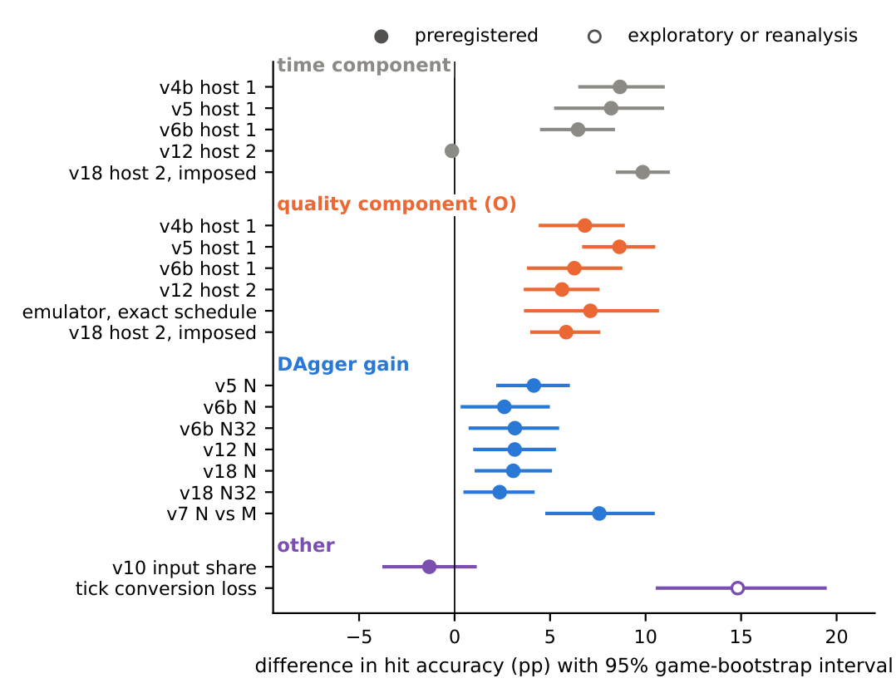
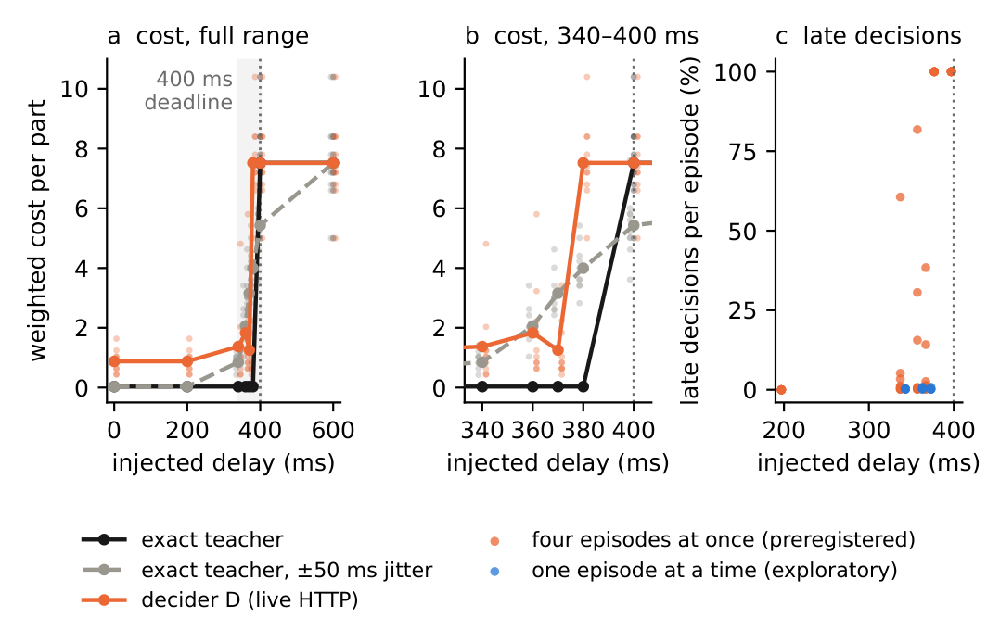

# Figures from the paper

These two figures come from the paper's preprint ([doi:10.5281/zenodo.23111659](https://doi.org/10.5281/zenodo.23111659)). The captions are the paper's own captions. The paper explains every arm and study name.

## Time and quality, every study on one axis

Primary contrasts of all studies on one axis: time components, quality components of the original decider (O), DAgger gains and two other contrasts, in hit-accuracy points with 95% game-bootstrap intervals. Filled: preregistered; open: reanalysis (tick conversion over distinct games). Host 2: studies v12 and v18; all others host 1.

In short: on the Windows host part of the gap is time and part is quality. On the Linux host the time part is close to zero, but the quality part stays.

## A deadline turns delay into a cliff

A deadline makes the time component a cliff (conveyor simulator, line A, asynchronous). (a) Cost per part by injected delay: exact teacher, teacher with ±50 ms jitter, decider D over HTTP; dots: episodes (10 per cell, 500 parts); dotted: 400 ms deadline. (b) 340 to 400 ms. (c) Late decisions: four episodes at once (preregistered), one at a time (exploratory).

In short: once the delay passes the 400 ms deadline, the quality component disappears. A better decider stops helping.

The conveyor simulator itself is in [examples/factory_twin](../examples/factory_twin/).
